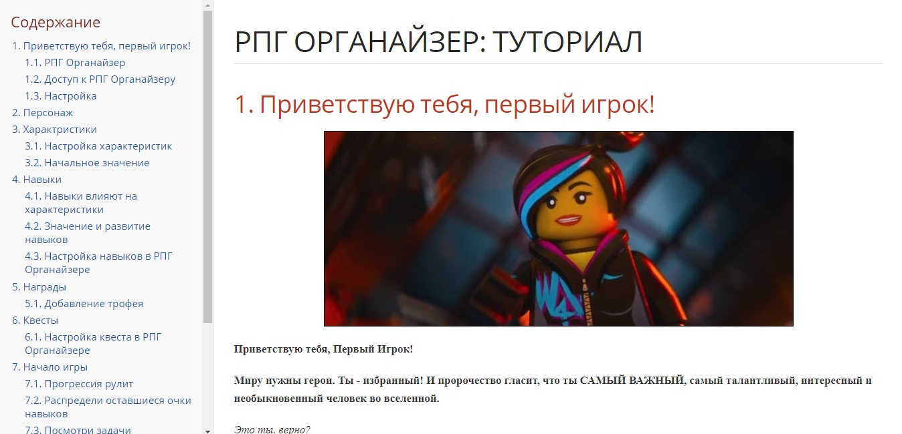

# Руководство к РПГ Органайзеру

Это - исходники руководства к [программе РПГ Органайзер](http://nerdistway.blogspot.com/2013/07/mylife-rpg-organizer.html).

**РПГ Органайзер это…**

**С одной стороны** - необычный таск-менеджер (ToDo List), в том плане, что ты назначаешь себе задания и выполняешь.

**С другой** - игра, нацеленная на самосовершенствование.

**РПГ Органайзер** это инструмент для самосовершенствования, организации режима дня и достижения баланса.

Создай персонажа, олицетворяющего тебя. Настрой способности, придумай увлекательные квесты и выполняй действия, повышающие твой уровень!

РПГ Органайзер - продвинутый гибрид ToDo списка и ролевой компьютерной игры.

Данное руководство [доступно онлайн...](https://pashkas.github.io/rpgorganizertutorial.github.io/)

## Разработка

Это руководство написано на языке разметки asciidoc, скомпилировано при помощи asciidoctor. Буду признателен за любые улучшения этого руководства)))

